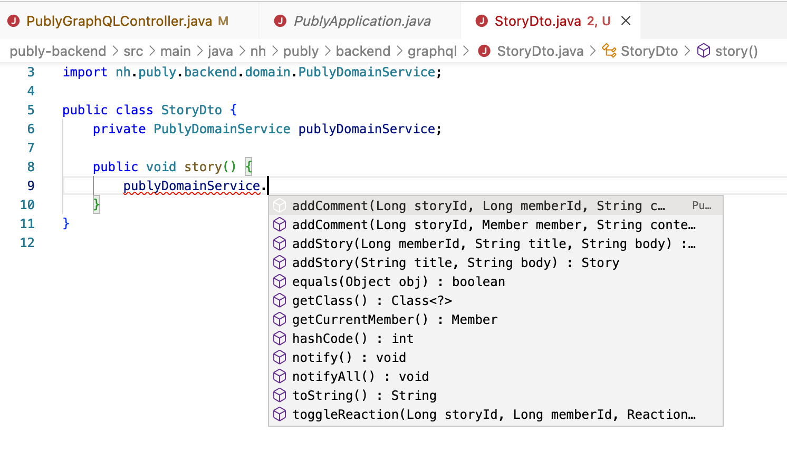
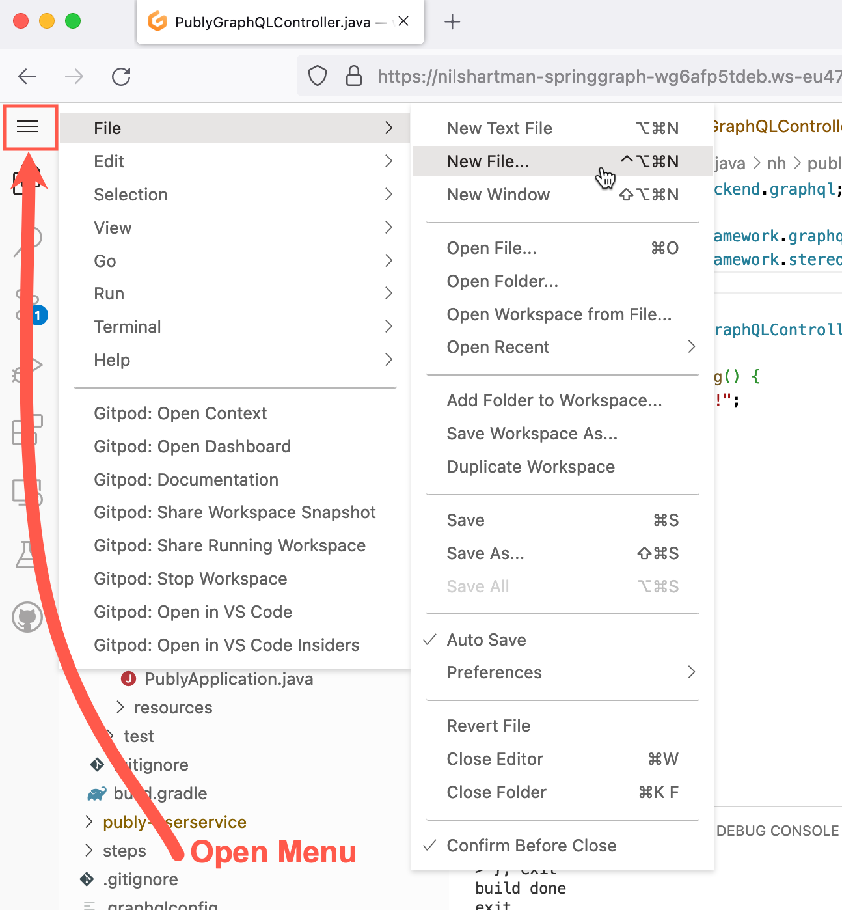

# Using the training workspace in GitPod

[GitPod](https://www.gitpod.io) is a cloud service for development environments. Using GitPod you can
access the training workspace directly in your browser without the need to install anything. GitPod will create a personal ("private") workspace for you in the cloud, including a Java-enabled Web IDE (VS Code).

Using the GitPod service is free of charge (at least for the amount of resources you need for this
training workspace).

## Before you start

Before you open your own training workspace with GitPod in the cloud, please make sure:

- You need a **GitHub** account to use GitPod. GitPod will use your GitHub account for authorization.
- When opening the workspace GitPod tries to open at least one new browser tab. Make sure you allow gitpod to open this new tab. You can find more informations in the [GitPod docs on Browser Settings](https://www.gitpod.io/docs/configure/browser-settings).

## Creating and opening the Workspace

To create your own workspace in the cloud, please click on the `Open in GitPod` button below.

After clicking the button, you will be asked to "Continue with GitHub" in order to login. Please click on the button and then (if asked for) enter your GitHub credentials.

After login, it might take some seconds until your workspace is created. Please stay tuned. And remember: GitPod will
open at least one additional browser tab, please do not deny this.

## Using the workspace

When GitPod has created your own workspace, it will open a VS Code editor instance in your browser with [Java support](https://code.visualstudio.com/docs/languages/java) installed. The Java Tooling
is powered by JDT, that forms the base of the Eclipse IDE Java Tooling, so it's quite powerful.

You can browse around, make changes (it compiles automatically when you save a file using Ctrl/Cmd+S), everything as it would be your
own, local workspace 😊. If you close the browser tab by accident, you can re-open the workspace simply by pressing the "Open in GitPod"-Button again.

In case you press the GitPod button and there is a workspace still running, you can deceide to re-open the running workspace
or to create a fresh new one.

## Services in the workspace

The training application consists of two "services" (Spring Boot Applications):

- `UserService`: simple mock user service. Just let it run, we don't need to work on that service.
- `PublyApplication` (or `Backend`). This is the central application we will work with in during the training.

Both services will be **compiled and started** automatically by Gitpod (see below) using Gradle.

## Working with the PublyApplication source code

You can use VS Code's Java Support to make modification to the
PublyApplication source code as you would do it locally.
Remember: it's your personal workspace, only that it is not a local
one, but running the cloud.

To **open a file**, you can use the [Command Palette](https://code.visualstudio.com/docs/getstarted/userinterface#_command-palette) that can be opened using Ctrl+P/Cmd+P. When open, just type the name (or
parts of it) of the file you want to open.

Inside the command palette, you can type a `#` followed by the name of a "Symbol" to open that symbol (class, method etc).

When editing your source code, you can get **Code Completion** etc. The "intellisense" widget either opens itself automatically or can be
opened using Ctrl+Space (as in most IDEs).

### **IMPORTANT: Saving files (also: avoid unwanted loss of changes**)

> **Warning**
> Per default setting, this workspace' VS Code **DOES NOT SAVE YOUR FILES AUTOMATICALLY**! If you by accident
> close your browser tab, your changes are gone 😰

In my experience the Auto Save feature too often saves files, which in turn leads to lots of (unnecessary and
unsuccesful) re-compilations.

So, please keep in mind that you regulary save your files (either Ctrl+S/Cmd+S or from file menu).

If you want the Auto Save feature back, you can enable it from the File menu.

### Creating new Java classes

To create a new Java class, simply right click on the package/folder
the new class should belong into and select "New File". Then enter the
new file/classname with `.java` suffix (for example `StoryDto.java`).
The file is then correctly created (with `package` and `class`) by
VS Code for you.

### Compiling the changes

After you made changes to your Java- or Resource-files,
you can press Ctrl+S/Cmd+S to save your file. Note that Ctrl+S/Cmd+S
is bound to save the current file only. "Save all" is available
from the file menu.

When the file is saved, your application is recompiled automatically.
That is the behaviour known from the Eclipse IDE. (Actually
Eclipse' JDT is the base for VS Code's Java support).

After your changed files have been compiled, the Publy Application
should restart automatically (thanks to the Spring Boot dev-tools).
Please have a look at the right tab in VS Code, where the `gradlew bootRun` process is running.

### Running Publy Application from VS Code

When you open your workspace, both services are started automatically
from the command line using gradle.

But of course you can also start the Publy Spring Boot application also from VS Code. To do so, please quit both gradle processes for
the Publy Backend (Ctrl+C). Then open `PublyApplication.java`,
hover with the mouse over the class name and choose either `Run`
or `Debug`.

When running the application from within VS Code, after compiling
your changes the app will be restarted automatically.

## Using GraphiQL

When the workspace starts and both services are up and runing, GraphiQL is opened in a new browser tab. If you close that window,
you can re-open it using the "Remote Explorer" in VS Code.

Please select the "Remote Explorer" in the "Activity Bar" on the left side, search for Port "8090" and click on "Open in Browser" on
the hover menu.

GraphiQL then will be opened in a new browser tab.

